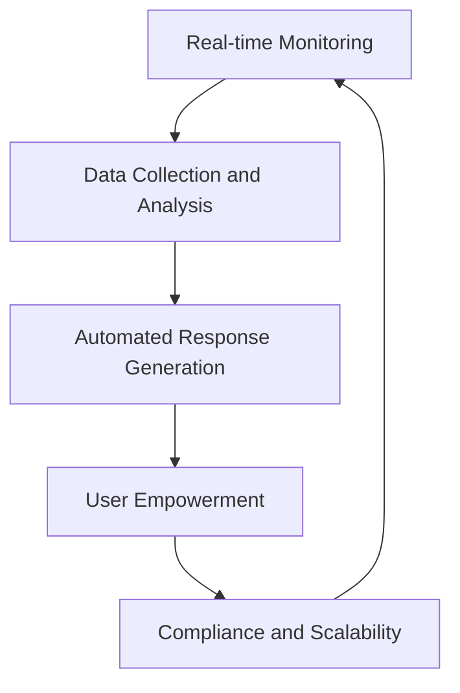
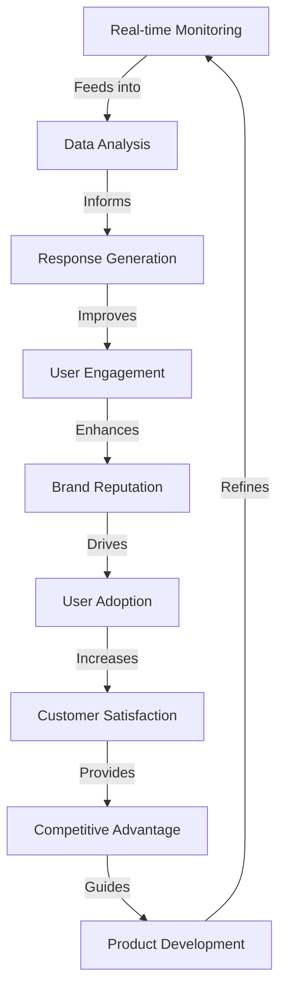
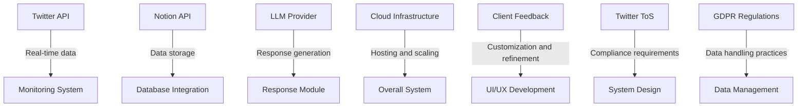
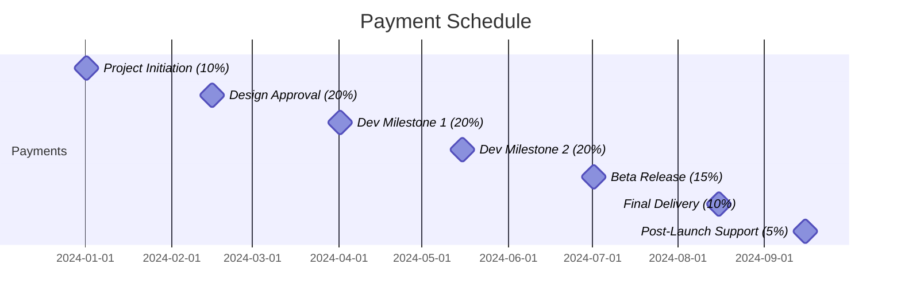
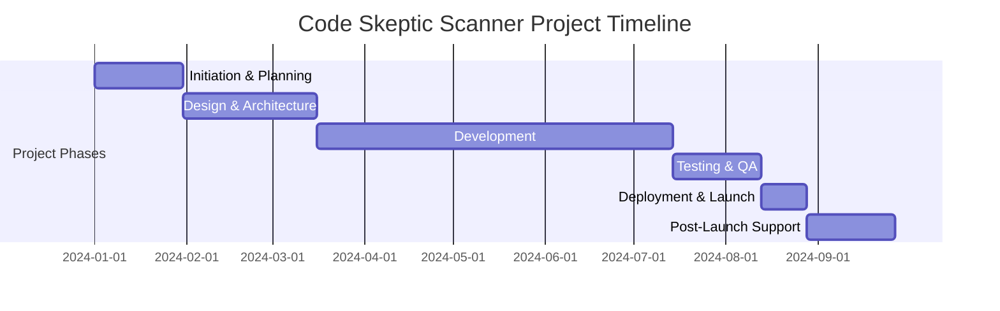
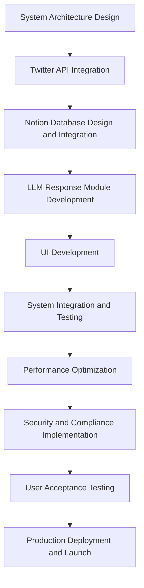
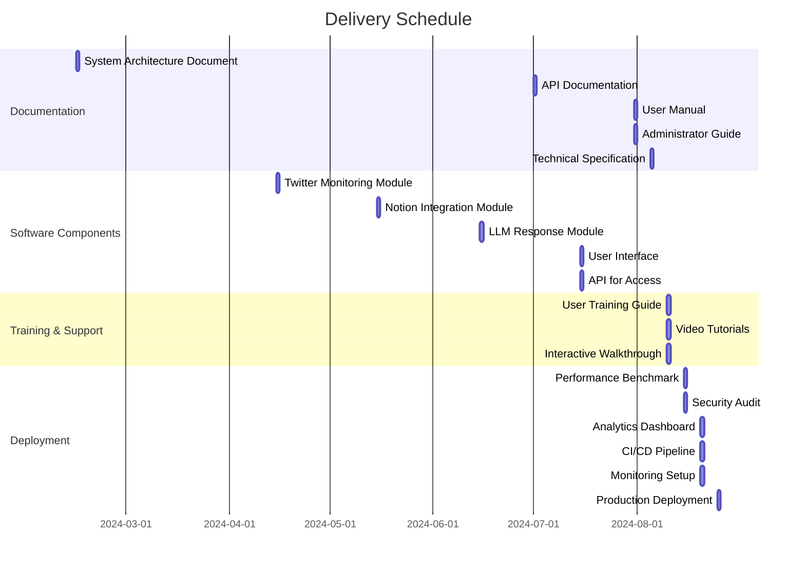

## EXECUTIVE SUMMARY

### PROJECT OVERVIEW

Code Skeptic Scanner is a cloud-based solution designed to monitor, analyze, and respond to skeptical or negative opinions about AI coding tools on Twitter/X in real-time. This innovative system addresses the growing need for companies in the AI development space to stay informed about public sentiment and engage proactively with their audience.

The solution will:
1. Monitor Twitter's Streaming API for relevant tweets
2. Analyze tweet content and popularity
3. Store extracted information in a Notion database
4. Generate appropriate responses using LLM technology
5. Provide a user-friendly interface for managing the entire process

By implementing Code Skeptic Scanner, our client will gain valuable insights into public perception of AI coding tools and have the ability to respond promptly and effectively to concerns or criticisms.

### OBJECTIVES

1. Real-time monitoring: Continuously track Twitter for skeptical or negative opinions about AI coding tools.
2. Data collection and analysis: Extract and store relevant information in a structured Notion database.
3. Automated response generation: Utilize LLM technology to create contextually appropriate responses to identified tweets.
4. User empowerment: Provide an intuitive UI and API for customizing monitoring parameters, managing responses, and analyzing trends.
5. Compliance and scalability: Ensure GDPR compliance, respect for Twitter's terms of service, and system scalability to handle high volumes of data.

### VALUE PROPOSITION

Our agency offers a unique combination of expertise and technology to deliver an unparalleled solution for monitoring and engaging with AI coding tool skepticism:

1. Comprehensive solution: We provide an end-to-end system that covers monitoring, analysis, storage, and response generation in a single, integrated platform.

2. Cutting-edge technology: By leveraging LLM technology for response generation, we ensure that replies are contextually relevant and aligned with the client's messaging.

3. Customization and flexibility: Our solution allows for easy adjustment of monitoring parameters, custom prompts, and context documents, enabling the client to fine-tune the system to their specific needs.

4. Real-time insights: With immediate Notion notifications and a user-friendly interface, the client can stay informed and responsive to emerging trends and criticisms.

5. Scalability and future-proofing: Our cloud-based architecture ensures that the system can handle increasing volumes of data and adapt to future changes in social media landscapes.

By choosing our agency for this project, the client will gain a powerful tool for managing public perception, engaging with their audience, and staying ahead in the competitive AI coding tool market.

## PROJECT OBJECTIVES

### BUSINESS GOALS

1. Enhance Brand Reputation: Improve public perception of AI coding tools by actively engaging with skeptics and addressing concerns in real-time.

2. Increase User Adoption: Drive higher adoption rates of AI coding tools by effectively countering misconceptions and showcasing benefits.

3. Improve Customer Satisfaction: Enhance user experience by promptly addressing doubts and providing accurate information about AI coding tools.

4. Gain Competitive Advantage: Stay ahead of competitors by being proactive in managing public sentiment and shaping the narrative around AI coding tools.

5. Inform Product Development: Gather valuable insights from user concerns to guide future improvements and features in AI coding tools.

### TECHNICAL GOALS

1. Real-time Monitoring System: Develop a robust system to continuously monitor Twitter's Streaming API for relevant tweets about AI coding tools.

2. Advanced Natural Language Processing: Implement sophisticated NLP algorithms to accurately identify skepticism and negative sentiments in tweets.

3. Scalable Data Storage: Create a scalable and efficient Notion database integration for storing and organizing extracted tweet information.

4. LLM-powered Response Generation: Develop an advanced response generation module using Large Language Models to create contextually appropriate and persuasive replies.

5. User-friendly Interface: Design and implement an intuitive UI and API for easy management of the monitoring and response processes.

6. Integration Capabilities: Ensure seamless integration with Twitter API, Notion API, and potential future platforms or tools.

7. High Performance and Reliability: Achieve high system uptime (99.9%) and low latency (< 500ms) for real-time monitoring and response generation.

### SUCCESS CRITERIA

| Criterion | Description | Target |
|-----------|-------------|--------|
| Tweet Identification Accuracy | Percentage of correctly identified skeptical/negative tweets | > 95% |
| Response Generation Quality | Percentage of generated responses rated as appropriate and effective by human reviewers | > 90% |
| System Uptime | Percentage of time the system is operational and accessible | 99.9% |
| Response Time | Average time from tweet detection to response generation | < 2 minutes |
| User Engagement | Percentage increase in positive interactions (likes, retweets, replies) on response tweets | 25% increase |
| Sentiment Shift | Percentage of initially skeptical users who express positive sentiment after interaction | > 30% |
| Database Update Speed | Average time to update Notion database with new tweet information | < 30 seconds |
| UI/API User Satisfaction | User satisfaction score based on surveys and feedback | > 4.5/5 |
| Scalability | System's ability to handle increased tweet volume without performance degradation | 10x current capacity |
| Compliance | Adherence to GDPR and Twitter's terms of service | 100% compliance |

This diagram illustrates the cyclical nature of the project objectives, showing how each goal feeds into and reinforces the others, creating a comprehensive system for managing and improving AI coding tool perception.

## SCOPE OF WORK

### IN-SCOPE

1. Twitter Monitoring System
   - Implement real-time monitoring of Twitter's Streaming API
   - Develop algorithms to identify tweets expressing skepticism or negative opinions about AI coding tools
   - Create a configurable popularity threshold mechanism

2. Data Extraction and Storage
   - Extract relevant information from identified tweets
   - Integrate with Notion API for data storage
   - Implement real-time Notion database updates
   - Set up Notion notifications for new tweet entries

3. LLM-powered Response Generation
   - Develop a response module using Large Language Models
   - Implement custom prompt and context document integration
   - Ensure generated responses align with @BlitzyAI account tone and messaging

4. User Interface and API
   - Design and develop a user-friendly web interface
   - Create an API for programmatic access to system functions
   - Implement features for adjusting monitoring parameters, managing responses, and customizing context
   - Embed Notion database view within the UI
   - Provide direct links to original tweets on Twitter/X

5. Error Handling and Compliance
   - Implement robust error handling and logging mechanisms
   - Ensure GDPR compliance and adherence to Twitter's terms of service

6. Scalability and Performance
   - Design system architecture for high availability and scalability
   - Optimize for real-time performance and low latency

7. Analytics and Reporting
   - Implement basic analytics features to track trends in AI coding tool skepticism
   - Develop simple reporting functionality within the UI

### OUT-OF-SCOPE

1. Advanced sentiment analysis beyond identifying skepticism or negative opinions
2. Integration with social media platforms other than Twitter/X
3. Automated posting of responses to Twitter (responses will be generated but not automatically posted)
4. Advanced natural language understanding or context comprehension beyond LLM capabilities
5. Development of mobile applications for the system
6. Integration with customer relationship management (CRM) systems
7. Advanced user role management or multi-tenant architecture
8. Automated translation of non-English tweets or responses
9. Historical data analysis or backfilling of tweets prior to system implementation

### ASSUMPTIONS

1. Client will provide necessary Twitter API access and credentials
2. Client has an existing Notion workspace and can provide required API access
3. Client will supply initial context documents and custom prompts for response generation
4. The @BlitzyAI Twitter account is set up and accessible for response posting
5. Client team members are familiar with Notion and can interact with the embedded database
6. The volume of relevant tweets will not exceed 10,000 per day during initial implementation
7. Client will provide timely feedback during development and testing phases
8. All team members have access to necessary development and testing environments

### DEPENDENCIES

1. Twitter API: The project relies on continued access to Twitter's Streaming API and adherence to their rate limits and terms of service.

2. Notion API: Stable access to Notion's API is crucial for data storage and retrieval functionalities.

3. LLM Provider: The response generation module depends on a reliable LLM service provider (e.g., OpenAI, Anthropic) for generating contextually appropriate responses.

4. Cloud Infrastructure: The system's performance and scalability depend on the chosen cloud provider's services and uptime.

5. Client Feedback: Timely input from the client is necessary for refining monitoring parameters, custom prompts, and UI/UX elements.

6. Twitter Terms of Service: Any changes to Twitter's terms of service may impact the system's functionality or compliance requirements.

7. GDPR and Data Protection Regulations: Ongoing compliance with data protection laws is essential for the project's legality and ethical operation.

8. Third-party Libraries and Frameworks: The project may depend on various open-source or commercial libraries for functionality, which need to be kept updated and compatible.

## BUDGET AND COST ESTIMATES

### COST BREAKDOWN

The following table provides a detailed breakdown of the project costs:

| Category | Item | Description | Cost (USD) |
|----------|------|-------------|------------|
| Labor | Project Manager | 480 hours @ $100/hr | 48,000 |
| Labor | Senior Software Engineer | 960 hours @ $120/hr | 115,200 |
| Labor | Full-Stack Developer | 800 hours @ $90/hr | 72,000 |
| Labor | UI/UX Designer | 320 hours @ $85/hr | 27,200 |
| Labor | QA Specialist | 400 hours @ $75/hr | 30,000 |
| Infrastructure | Cloud Services | AWS or GCP hosting for 12 months | 15,000 |
| Infrastructure | Twitter API | Enterprise access for 12 months | 5,000 |
| Infrastructure | Notion API | Business plan for 12 months | 2,400 |
| Infrastructure | LLM API | OpenAI or similar, estimated usage | 10,000 |
| Software | Development Tools | IDEs, version control, etc. | 3,000 |
| Software | Monitoring & Analytics | New Relic or similar, 12 months | 4,800 |
| Miscellaneous | Contingency | 10% of total budget | 33,260 |
| | | **Total** | **365,860** |

### PAYMENT SCHEDULE

The proposed payment schedule is tied to project milestones and deliverables:

1. Project Initiation (10%): $36,586
   - Upon contract signing and project kickoff

2. Design and Architecture Approval (20%): $73,172
   - Completion of system design and architecture documentation
   - Approval of UI/UX mockups

3. Development Milestone 1 (20%): $73,172
   - Completion of Twitter monitoring system
   - Integration with Notion API for data storage

4. Development Milestone 2 (20%): $73,172
   - Implementation of LLM-powered response generation
   - Development of basic UI and API

5. Beta Release (15%): $54,879
   - Completion of full system integration
   - Successful beta testing with client team

6. Final Delivery (10%): $36,586
   - System deployment to production
   - Completion of user training and documentation

7. Post-Launch Support (5%): $18,293
   - 30 days after successful launch
   - Resolution of any post-launch issues

### BUDGET CONSIDERATIONS

1. API Usage Fluctuations: The costs associated with Twitter API, Notion API, and LLM API usage may vary based on actual system usage. We've provided conservative estimates, but actual costs could be higher if tweet volume or response generation needs exceed expectations.

   Mitigation: Implement usage monitoring and alerts to track API consumption. Include provisions in the contract for adjusting the budget if usage significantly exceeds estimates.

2. Cloud Infrastructure Scaling: As the system scales to handle increased tweet volume, cloud infrastructure costs may increase.

   Mitigation: Design the system with auto-scaling capabilities and implement cost optimization strategies. Regular reviews of cloud usage and costs will be conducted to ensure efficiency.

3. Extended Development Time: If the project timeline extends due to unforeseen complexities or changes in requirements, labor costs could increase.

   Mitigation: Maintain a detailed project schedule with built-in buffer time. Any significant changes to the project scope will be addressed through a formal change request process, potentially adjusting the budget.

4. Currency Fluctuations: For any international vendors or services, currency exchange rate fluctuations could impact costs.

   Mitigation: Where possible, lock in rates with vendors for the project duration. For significant international expenses, consider hedging options to minimize risk.

5. Regulatory Compliance Changes: Changes in data protection laws or Twitter's terms of service may require additional development work to ensure compliance.

   Mitigation: Stay informed about upcoming regulatory changes. The contingency budget can be used to address minor compliance updates, while significant changes may require a separate change order.

6. Third-Party Tool Price Changes: Increases in the pricing of critical third-party tools or services could impact the overall budget.

   Mitigation: Research alternative tools and have backup options identified. Where possible, lock in pricing for the project duration through contracts or pre-payment.

7. Performance Optimization Needs: If the system requires additional performance optimization to meet latency or throughput requirements, it may lead to increased development costs.

   Mitigation: Conduct thorough performance testing early in the development process. The contingency budget can be used to address minor optimization needs.

By actively managing these budget considerations and maintaining open communication with the client, we aim to deliver the project within the proposed budget while being prepared to address potential variations in a transparent and efficient manner.

## TIMELINE AND MILESTONES

### PROJECT TIMELINE

### KEY MILESTONES

| Milestone | Description | Target Date |
|-----------|-------------|-------------|
| M1: Project Kickoff | Complete project initiation, team onboarding, and initial planning | 2024-01-15 |
| M2: Design Approval | Finalize system architecture and UI/UX designs | 2024-03-01 |
| M3: Twitter Monitoring System | Complete development of real-time Twitter monitoring functionality | 2024-04-30 |
| M4: Notion Integration | Finish Notion API integration for data storage and notifications | 2024-05-31 |
| M5: LLM Response Module | Complete development of LLM-powered response generation system | 2024-06-30 |
| M6: UI and API Completion | Finalize user interface and API development | 2024-07-31 |
| M7: Beta Release | Launch beta version for client testing and feedback | 2024-08-15 |
| M8: Production Deployment | Deploy fully tested system to production environment | 2024-08-25 |
| M9: Project Closure | Complete post-launch support and project documentation | 2024-09-27 |

### CRITICAL PATH

The following tasks represent the critical path for the Code Skeptic Scanner project:

1. System Architecture Design (15 days)
   - Critical for establishing the foundation of the entire system

2. Twitter API Integration (20 days)
   - Essential for real-time monitoring functionality

3. Notion Database Design and Integration (25 days)
   - Crucial for data storage and organization

4. LLM Response Module Development (30 days)
   - Key feature for generating appropriate responses

5. UI Development (35 days)
   - Necessary for user interaction and system management

6. System Integration and Testing (20 days)
   - Critical for ensuring all components work together seamlessly

7. Performance Optimization (10 days)
   - Essential for meeting real-time processing requirements

8. Security and Compliance Implementation (15 days)
   - Crucial for GDPR compliance and data protection

9. User Acceptance Testing (10 days)
   - Final validation before production deployment

10. Production Deployment and Launch (5 days)
    - Final step to make the system operational

This critical path represents the sequence of tasks that directly impact the project's timeline. Any delays in these tasks will likely result in a delay of the entire project. Careful management and resource allocation to these tasks are essential for maintaining the project schedule.

## DELIVERABLES

### LIST OF DELIVERABLES

1. Software Components
   - Twitter Monitoring Module
   - Notion Database Integration Module
   - LLM-powered Response Generation Module
   - User Interface (Web Application)
   - API for Programmatic Access

2. Documentation
   - System Architecture Document
   - API Documentation
   - User Manual
   - Administrator Guide
   - Technical Specification Document

3. Training Materials
   - User Training Guide
   - Video Tutorials for Key Features
   - Interactive Walkthrough for UI

4. Deployment and Support
   - Deployed Production System
   - Continuous Integration/Continuous Deployment (CI/CD) Pipeline
   - Monitoring and Alerting Setup

5. Reports and Analytics
   - Performance Benchmark Report
   - Security Audit Report
   - Analytics Dashboard

### DELIVERY SCHEDULE

| Deliverable | Expected Delivery Date |
|-------------|------------------------|
| System Architecture Document | 2024-02-15 |
| Twitter Monitoring Module | 2024-04-15 |
| Notion Database Integration Module | 2024-05-15 |
| LLM-powered Response Generation Module | 2024-06-15 |
| API Documentation | 2024-07-01 |
| User Interface (Web Application) | 2024-07-15 |
| API for Programmatic Access | 2024-07-15 |
| User Manual | 2024-07-31 |
| Administrator Guide | 2024-07-31 |
| Technical Specification Document | 2024-08-05 |
| User Training Guide | 2024-08-10 |
| Video Tutorials | 2024-08-10 |
| Interactive Walkthrough | 2024-08-10 |
| Performance Benchmark Report | 2024-08-15 |
| Security Audit Report | 2024-08-15 |
| Analytics Dashboard | 2024-08-20 |
| CI/CD Pipeline | 2024-08-20 |
| Monitoring and Alerting Setup | 2024-08-20 |
| Deployed Production System | 2024-08-25 |

### ACCEPTANCE CRITERIA

1. Twitter Monitoring Module
   - Successfully connects to Twitter's Streaming API
   - Accurately identifies tweets expressing skepticism about AI coding tools
   - Processes at least 1000 tweets per minute without performance degradation
   - Correctly applies the configurable popularity threshold

2. Notion Database Integration Module
   - Seamlessly integrates with Notion API
   - Correctly stores all required tweet information in the specified format
   - Updates Notion database in real-time (< 30 seconds delay)
   - Triggers Notion notifications for new entries

3. LLM-powered Response Generation Module
   - Generates contextually appropriate responses to identified tweets
   - Incorporates custom prompts and context documents in response generation
   - Produces responses aligned with @BlitzyAI account tone and messaging
   - Generates responses within 60 seconds of tweet identification

4. User Interface (Web Application)
   - Intuitive and responsive design across desktop and mobile devices
   - Allows adjustment of all specified parameters (popularity threshold, context, prompts)
   - Successfully embeds Notion database view
   - Provides direct links to original tweets on Twitter/X

5. API for Programmatic Access
   - Adheres to RESTful API design principles
   - Includes all specified functionalities (parameter adjustment, manual response triggering, context management)
   - Achieves <100ms response time for 95% of requests under normal load
   - Implements proper authentication and authorization mechanisms

6. Documentation
   - Comprehensive coverage of all system components and functionalities
   - Clear, concise, and technically accurate content
   - Includes relevant diagrams, code snippets, and examples
   - Passes review by technical and non-technical stakeholders

7. Training Materials
   - Covers all key features and use cases of the system
   - Includes hands-on exercises and real-world scenarios
   - Achieves a minimum 90% satisfaction rate from a test group of users

8. Deployed Production System
   - Meets or exceeds 99.9% uptime during a 7-day monitoring period
   - Successfully handles peak load of 10,000 tweets per minute without performance degradation
   - Passes all security and compliance checks (GDPR, Twitter ToS)
   - Integrates seamlessly with client's existing infrastructure

9. Analytics Dashboard
   - Provides real-time updates on key metrics (tweets processed, responses generated, engagement rates)
   - Allows customizable date ranges for trend analysis
   - Exports data in common formats (CSV, JSON)
   - Loads within 3 seconds for 30-day data range

10. Performance and Security
    - Achieves <500ms end-to-end latency for tweet processing and response generation
    - Passes penetration testing with no critical or high vulnerabilities
    - Implements proper data encryption at rest and in transit
    - Complies with client's data retention and privacy policies

Each deliverable will be considered accepted when it meets all specified criteria and receives formal sign-off from the designated client representative.