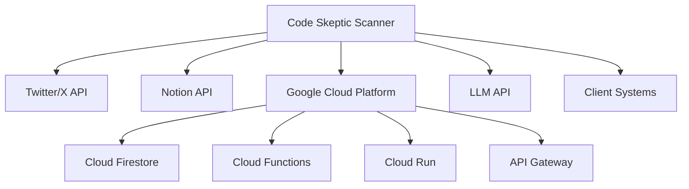
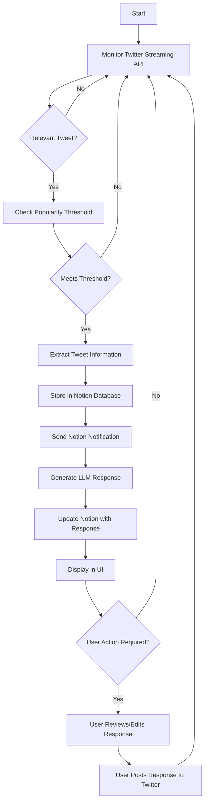
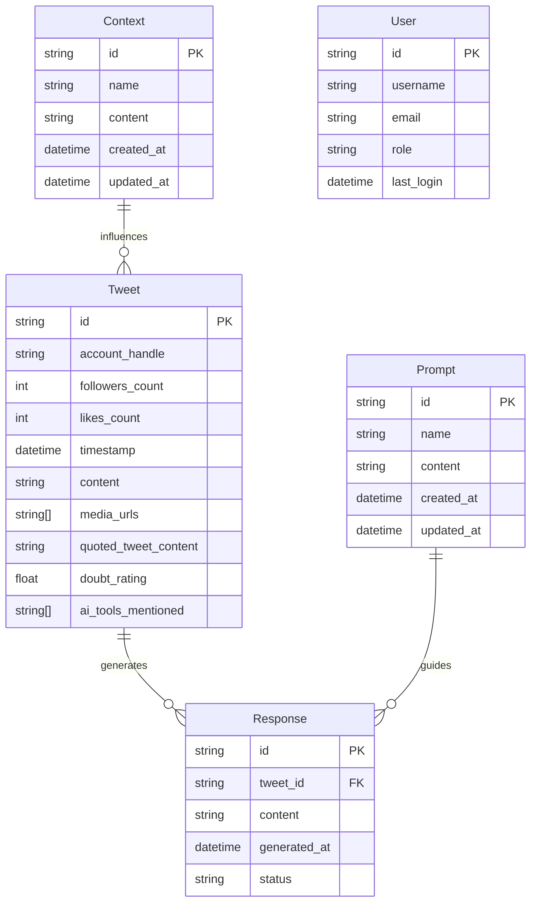
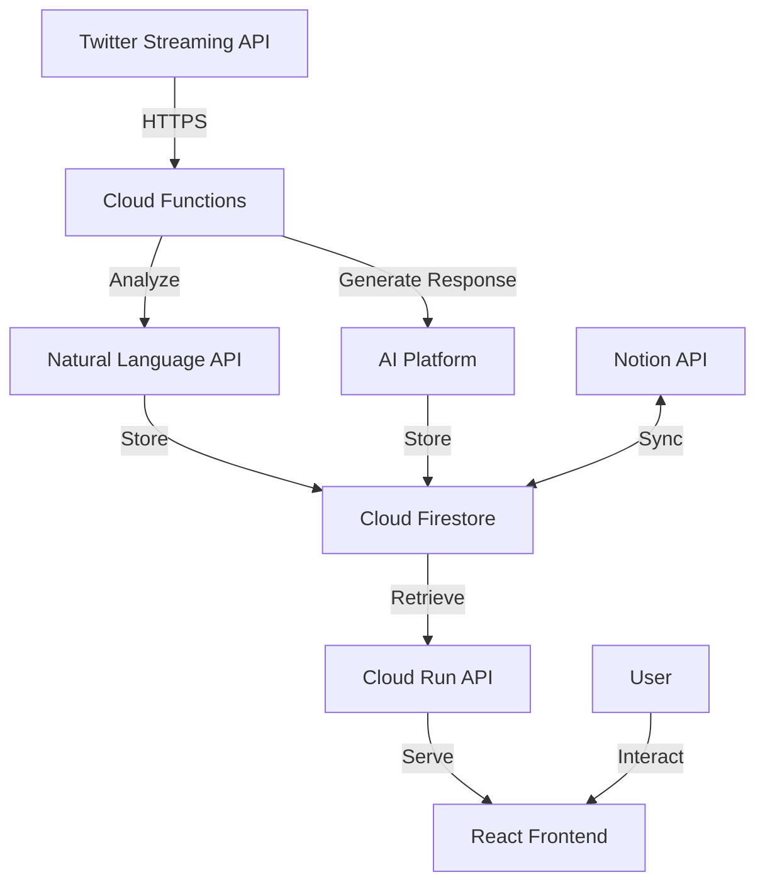

## INTRODUCTION

### PURPOSE

The purpose of this Software Requirements Specification (SRS) document is to provide a comprehensive and detailed description of the Code Skeptic Scanner system. This document serves as the primary reference for the development team, project stakeholders, and quality assurance personnel throughout the software development lifecycle.

The intended audience for this SRS includes:

1. Development Team: Software engineers, designers, and architects responsible for implementing the system.
2. Project Managers: To guide project planning, resource allocation, and timeline management.
3. Quality Assurance Team: For creating test plans and ensuring the system meets specified requirements.
4. Client Stakeholders: To review and approve the proposed system functionality and design.
5. Maintenance and Support Teams: For future reference in system updates and troubleshooting.

This document aims to:
- Clearly define the functional and non-functional requirements of the Code Skeptic Scanner.
- Establish a mutual understanding between the development team and stakeholders.
- Serve as a basis for system design, implementation, and testing.
- Provide a benchmark for validating the final product against initial requirements.

### SCOPE

Code Skeptic Scanner is a cloud-based solution designed to monitor, analyze, and respond to skeptical or negative opinions about AI coding tools on Twitter/X in real-time. The system aims to empower companies in the AI development space to stay informed about public sentiment and engage proactively with their audience.

Key goals and benefits of the system include:

1. Real-time Monitoring: Continuously track and identify relevant tweets expressing skepticism about AI coding tools.
2. Data-driven Insights: Collect and analyze tweet data to understand trends and patterns in public opinion.
3. Automated Response Generation: Utilize advanced language models to create contextually appropriate responses to identified tweets.
4. Enhanced Brand Management: Enable quick and effective responses to public concerns, improving brand reputation and user trust.
5. Streamlined Workflow: Provide a centralized platform for monitoring, analysis, and engagement, increasing team efficiency.

Core functionalities of the Code Skeptic Scanner include:

1. Twitter Streaming API Integration: Real-time monitoring of Twitter for relevant tweets.
2. Sentiment Analysis: Identification of skepticism and negative opinions in tweet content.
3. Notion Database Integration: Structured storage of tweet information and generated responses.
4. LLM-powered Response Generation: Creation of contextually appropriate responses using advanced language models.
5. User Interface: A web-based dashboard for system management and data visualization.
6. API Access: Programmatic interface for integration with other tools and custom workflows.
7. Analytics and Reporting: Trend analysis and performance metrics for informed decision-making.

The system will be built using the following key technologies:

- Frontend: React with TypeScript and Tailwind CSS for a responsive and modern user interface.
- Backend: Python for robust server-side logic and data processing.
- Cloud Infrastructure: Google Cloud Platform for scalable and reliable hosting.
- Database: Google Cloud Firestore for real-time data storage and synchronization.
- API Gateway: Google Cloud API Gateway for secure and efficient API management.
- Machine Learning: Google Cloud AI Platform for hosting and serving machine learning models.

By implementing the Code Skeptic Scanner, organizations will gain a powerful tool for managing public perception, engaging with their audience effectively, and staying ahead in the competitive AI coding tool market.

## PRODUCT DESCRIPTION

### PRODUCT PERSPECTIVE

Code Skeptic Scanner is a cloud-based solution designed to operate within the broader ecosystem of social media monitoring, sentiment analysis, and automated response systems. It specifically focuses on the niche of AI coding tool perception on Twitter/X. The system integrates with several external services and platforms:

1. Twitter/X Platform: The primary source of data, providing real-time tweets through its Streaming API.

2. Notion: Serves as the central database for storing and organizing extracted tweet information and generated responses.

3. Google Cloud Platform (GCP): Provides the infrastructure and services for hosting, scaling, and managing the application.

4. Large Language Model (LLM) API: Powers the response generation module, likely using a service like OpenAI's GPT or Google's PaLM.

The system is designed to be a standalone product but can potentially integrate with other marketing, customer relationship management (CRM), or business intelligence tools through its API.



### PRODUCT FUNCTIONS

Code Skeptic Scanner provides the following key functions:

1. Real-time Tweet Monitoring: Continuously monitors Twitter's Streaming API to identify tweets expressing skepticism or negative opinions about AI coding tools.

2. Sentiment Analysis: Analyzes tweet content to determine the level of skepticism or negativity towards AI coding tools.

3. Data Extraction and Storage: Extracts relevant information from identified tweets and stores it in a structured Notion database.

4. Automated Response Generation: Utilizes LLM technology to generate contextually appropriate responses to identified tweets.

5. Notification System: Sends real-time notifications to relevant team members when new tweets are added to the database.

6. User Interface: Provides a web-based dashboard for monitoring incoming tweets, reviewing collected data, and managing system parameters.

7. API Access: Offers a RESTful API for programmatic access to system functions and data.

8. Analytics and Reporting: Generates insights and trends related to AI coding tool skepticism over time.

9. Customization Tools: Allows users to adjust monitoring parameters, add custom prompts and context for response generation, and fine-tune the system's behavior.

### USER CHARACTERISTICS

The Code Skeptic Scanner is designed for use by several types of users within organizations developing or promoting AI coding tools:

1. Social Media Managers:
   - Expertise: High proficiency in social media platforms, moderate technical knowledge
   - Responsibilities: Monitoring tweets, reviewing generated responses, engaging with users
   - Persona: Sarah, 28, Digital Marketing Specialist at an AI startup

2. Product Managers:
   - Expertise: Deep understanding of AI coding tools, moderate social media knowledge
   - Responsibilities: Analyzing trends, informing product decisions based on user feedback
   - Persona: Alex, 35, Senior Product Manager for an AI-assisted coding platform

3. Data Analysts:
   - Expertise: Strong data analysis skills, familiarity with APIs and databases
   - Responsibilities: Generating reports, identifying patterns in user sentiment
   - Persona: Raj, 30, Data Scientist specializing in NLP and sentiment analysis

4. Technical Support Team:
   - Expertise: In-depth knowledge of AI coding tools, good communication skills
   - Responsibilities: Addressing technical concerns raised in tweets, providing accurate information
   - Persona: Elena, 32, Senior Technical Support Engineer for AI development tools

5. System Administrators:
   - Expertise: Strong technical background, experience with cloud platforms and APIs
   - Responsibilities: Managing system configuration, ensuring performance and security
   - Persona: Marcus, 40, DevOps Engineer with a focus on AI and machine learning infrastructure

### CONSTRAINTS

1. Twitter API Limitations:
   - Rate limits imposed by Twitter's API
   - Potential changes to Twitter's terms of service or API functionality

2. Data Privacy Regulations:
   - Compliance with GDPR and other relevant data protection laws
   - Restrictions on data storage and processing locations

3. Response Time Requirements:
   - System must identify relevant tweets and generate responses within 2 minutes

4. Scalability Constraints:
   - Initial system design must handle up to 10,000 relevant tweets per day
   - Future scalability to handle increased tweet volumes without significant re-architecture

5. Language Limitations:
   - Initial version will only support English language tweets and responses

6. Integration Restrictions:
   - Must integrate with specified versions of Twitter API, Notion API, and chosen LLM API

7. User Interface Compatibility:
   - Web application must be compatible with the latest versions of Chrome, Firefox, Safari, and Edge browsers

8. Budget Constraints:
   - Development and operational costs must remain within the specified project budget

9. Timeline Restrictions:
   - Project must be completed within the 9-month timeline outlined in the project plan

### ASSUMPTIONS AND DEPENDENCIES

Assumptions:

1. Twitter's Streaming API will remain available and functionally consistent throughout the project development and operation.

2. The volume of relevant tweets will not exceed 10,000 per day during the initial implementation phase.

3. Notion will continue to support the required API functionalities for database integration.

4. The chosen LLM provider will maintain consistent API access and performance for response generation.

5. The client will provide timely feedback and approvals at key project milestones.

6. Users of the system will have a basic understanding of AI coding tools and social media concepts.

7. The @BlitzyAI Twitter account will remain active and accessible for response posting.

Dependencies:

1. Twitter API: The project relies on continued access to Twitter's Streaming API and adherence to their rate limits and terms of service.

2. Notion API: Stable access to Notion's API is crucial for data storage and retrieval functionalities.

3. Google Cloud Platform: The system's performance, scalability, and reliability depend on GCP services, including:
   - Google Cloud Firestore for real-time data storage
   - Google Cloud Functions for serverless compute
   - Google Cloud Run for containerized application hosting
   - Google Cloud API Gateway for API management

4. LLM Provider: The response generation module depends on a reliable LLM service provider (e.g., OpenAI, Google PaLM) for generating contextually appropriate responses.

5. React and Tailwind CSS: The user interface development depends on these frameworks for efficient and responsive design.

6. Python: The backend development relies on Python and its ecosystem of libraries for data processing and API integrations.

7. Client Resources: The project depends on the client providing necessary access to Twitter and Notion accounts, as well as any required internal documentation or context for AI coding tools.

8. Third-party Libraries: Various open-source libraries and tools will be used in development, requiring ongoing compatibility and security updates.

## PROCESS FLOWCHART

The following flowchart illustrates the main processes of the Code Skeptic Scanner system:



This flowchart represents the core processes of the Code Skeptic Scanner system, from monitoring tweets to generating and posting responses. Here's a breakdown of each step:

1. The system starts by continuously monitoring the Twitter Streaming API.
2. For each tweet, it determines if it's relevant (i.e., expresses skepticism about AI coding tools).
3. If relevant, it checks if the tweet meets the configured popularity threshold.
4. If the threshold is met, the system extracts the tweet information.
5. The extracted information is stored in the Notion database.
6. A Notion notification is sent to alert the team of the new tweet.
7. The LLM-powered response generation module creates an appropriate response.
8. The generated response is added to the Notion database entry.
9. The UI is updated to display the new tweet and generated response.
10. If user action is required (e.g., to review or edit the response), the user can do so through the UI.
11. The user can then choose to post the response to Twitter directly from the application.
12. The process then loops back to continue monitoring for new tweets.

This flowchart provides a high-level overview of the system's operation. The actual implementation will involve more detailed processes, error handling, and parallel operations to ensure efficient performance.

The UI components mentioned in the flowchart will be implemented using React with TypeScript and Tailwind CSS, as specified in previous sections. The backend processes, including Twitter API integration, Notion database management, and LLM response generation, will be implemented in Python to maintain consistency with the technology choices made earlier in the document.

Here's a breakdown of the Code Skeptic Scanner product into features, using the specified technologies and following the requested format:

ID: F1
DESCRIPTION: Real-time Twitter Monitoring
PRIORITY: High
TABLE OF FUNCTIONAL REQUIREMENTS:

| ID | Requirement | Description |
|----|-------------|-------------|
| F1.1 | Twitter API Integration | Integrate with Twitter's Streaming API to capture real-time tweets |
| F1.2 | Tweet Filtering | Implement algorithms to identify tweets expressing skepticism about AI coding tools |
| F1.3 | Popularity Threshold | Apply configurable popularity threshold based on likes and follower count |
| F1.4 | Rate Limiting Handling | Implement mechanisms to handle Twitter API rate limits and ensure continuous monitoring |

ID: F2
DESCRIPTION: Notion Database Integration
PRIORITY: High
TABLE OF FUNCTIONAL REQUIREMENTS:

| ID | Requirement | Description |
|----|-------------|-------------|
| F2.1 | Notion API Integration | Integrate with Notion API for data storage and retrieval |
| F2.2 | Tweet Data Extraction | Extract relevant information from identified tweets and store in Notion database |
| F2.3 | Real-time Updates | Ensure Notion database is updated in real-time (within 30 seconds of tweet identification) |
| F2.4 | Notion Notifications | Implement Notion notifications for new tweet entries |

ID: F3
DESCRIPTION: LLM-powered Response Generation
PRIORITY: High
TABLE OF FUNCTIONAL REQUIREMENTS:

| ID | Requirement | Description |
|----|-------------|-------------|
| F3.1 | LLM Integration | Integrate with a Large Language Model API (e.g., OpenAI, Google PaLM) |
| F3.2 | Context Management | Allow addition and management of custom prompts and context documents |
| F3.3 | Response Generation | Generate contextually appropriate responses to identified tweets |
| F3.4 | Tone Alignment | Ensure generated responses align with @BlitzyAI account tone and messaging |

ID: F4
DESCRIPTION: User Interface
PRIORITY: High
TABLE OF FUNCTIONAL REQUIREMENTS:

| ID | Requirement | Description |
|----|-------------|-------------|
| F4.1 | Dashboard | Create a React-based dashboard with real-time updates of monitored tweets |
| F4.2 | Notion Database Embed | Embed Notion database view within the UI for easy access to collected data |
| F4.3 | Parameter Management | Implement UI controls for adjusting monitoring parameters and thresholds |
| F4.4 | Response Management | Provide interface for reviewing, editing, and posting generated responses |

ID: F5
DESCRIPTION: API for Programmatic Access
PRIORITY: Medium
TABLE OF FUNCTIONAL REQUIREMENTS:

| ID | Requirement | Description |
|----|-------------|-------------|
| F5.1 | RESTful API | Develop a RESTful API for programmatic access to system functions |
| F5.2 | Authentication | Implement secure authentication mechanism for API access |
| F5.3 | CRUD Operations | Enable Create, Read, Update, Delete operations for relevant data entities |
| F5.4 | Rate Limiting | Implement rate limiting to prevent API abuse |

ID: F6
DESCRIPTION: Analytics and Reporting
PRIORITY: Medium
TABLE OF FUNCTIONAL REQUIREMENTS:

| ID | Requirement | Description |
|----|-------------|-------------|
| F6.1 | Trend Analysis | Implement analytics features to track trends in AI coding tool skepticism |
| F6.2 | Performance Metrics | Track and display system performance metrics (e.g., response time, tweet volume) |
| F6.3 | Custom Reports | Allow users to generate custom reports based on collected data |
| F6.4 | Data Visualization | Create interactive charts and graphs using React components |

ID: F7
DESCRIPTION: Error Handling and Logging
PRIORITY: Medium
TABLE OF FUNCTIONAL REQUIREMENTS:

| ID | Requirement | Description |
|----|-------------|-------------|
| F7.1 | Error Logging | Implement comprehensive error logging system |
| F7.2 | Alerting System | Set up alerts for critical errors or system issues |
| F7.3 | Error Recovery | Develop mechanisms for automatic recovery from common error scenarios |
| F7.4 | Log Analysis | Provide tools for analyzing error logs and identifying patterns |

ID: F8
DESCRIPTION: Scalability and Performance Optimization
PRIORITY: High
TABLE OF FUNCTIONAL REQUIREMENTS:

| ID | Requirement | Description |
|----|-------------|-------------|
| F8.1 | Cloud Deployment | Deploy the system on Google Cloud Platform for scalability |
| F8.2 | Load Balancing | Implement load balancing to distribute traffic evenly |
| F8.3 | Caching | Utilize caching mechanisms to improve response times |
| F8.4 | Database Optimization | Optimize Notion database queries and indexing for performance |

ID: F9
DESCRIPTION: Compliance and Security
PRIORITY: High
TABLE OF FUNCTIONAL REQUIREMENTS:

| ID | Requirement | Description |
|----|-------------|-------------|
| F9.1 | GDPR Compliance | Ensure all data handling practices comply with GDPR regulations |
| F9.2 | Data Encryption | Implement encryption for data at rest and in transit |
| F9.3 | Access Control | Develop role-based access control for different user types |
| F9.4 | Audit Logging | Implement audit logging for all system actions and data access |

ID: F10
DESCRIPTION: User Training and Documentation
PRIORITY: Low
TABLE OF FUNCTIONAL REQUIREMENTS:

| ID | Requirement | Description |
|----|-------------|-------------|
| F10.1 | User Manual | Create comprehensive user manual for the system |
| F10.2 | Video Tutorials | Develop video tutorials for key system features |
| F10.3 | In-app Guidance | Implement in-app tooltips and guided tours using React components |
| F10.4 | Knowledge Base | Set up a searchable knowledge base for user self-service |

These features cover the core functionalities of the Code Skeptic Scanner system, aligning with the previously specified technologies and maintaining consistency with earlier sections of the document. The use of TypeScript, React, and Tailwind CSS for the frontend, Python for the backend, and Google Cloud solutions for infrastructure ensures a modern, scalable, and maintainable system architecture.

## NON-FUNCTIONAL REQUIREMENTS

### PERFORMANCE

1. Response Time
   - The system shall process and store incoming tweets within 2 seconds of receipt.
   - LLM-generated responses shall be produced within 5 seconds of tweet identification.
   - The web UI shall load initial content within 1.5 seconds on a standard broadband connection.

2. Throughput
   - The system shall handle a minimum of 1,000 tweets per minute during normal operation.
   - The API shall support at least 100 concurrent user requests without degradation in performance.

3. Resource Usage
   - The system shall utilize no more than 80% of allocated CPU resources during peak loads.
   - Memory usage shall not exceed 4GB per container instance.
   - Database queries shall complete within 100ms for 95% of requests.

### SAFETY

1. Data Backup
   - The system shall perform automated backups of the Notion database every 6 hours.
   - Backups shall be stored in a separate Google Cloud Storage bucket with versioning enabled.

2. Fault Tolerance
   - The system shall continue functioning with degraded performance if one or more microservices fail.
   - In case of LLM API failure, the system shall queue requests for later processing and notify administrators.

3. Error Handling
   - All errors shall be logged with timestamps, error types, and relevant context information.
   - Critical errors shall trigger immediate notifications to the development and operations teams.

4. Data Integrity
   - The system shall implement transaction management to ensure data consistency across all operations.
   - Data validation checks shall be performed on all inputs to prevent corruption or injection attacks.

### SECURITY

1. Authentication
   - The system shall use OAuth 2.0 for user authentication.
   - Multi-factor authentication shall be available for all user accounts.

2. Authorization
   - Role-based access control (RBAC) shall be implemented to manage user permissions.
   - API access shall require valid API keys with defined scopes.

3. Data Encryption
   - All data at rest shall be encrypted using AES-256 encryption.
   - All data in transit shall be encrypted using TLS 1.3 or higher.

4. Privacy
   - Personal data shall be anonymized or pseudonymized where possible.
   - The system shall provide mechanisms for users to request their data and exercise their GDPR rights.

5. Security Monitoring
   - The system shall log all access attempts, successful or not.
   - Intrusion detection systems shall be implemented to monitor for suspicious activities.

### QUALITY

1. Availability
   - The system shall maintain 99.9% uptime, measured on a monthly basis.
   - Planned maintenance windows shall not exceed 4 hours per month and must be scheduled during off-peak hours.

2. Maintainability
   - The codebase shall maintain a minimum of 80% test coverage.
   - All code shall adhere to agreed-upon style guides (PEP 8 for Python, Airbnb style guide for React/TypeScript).
   - Documentation shall be updated within 24 hours of any system changes.

3. Usability
   - The user interface shall be responsive and functional on devices with screen sizes from 320px to 2560px wide.
   - The system shall support the latest two major versions of Chrome, Firefox, Safari, and Edge browsers.
   - All user interface elements shall be accessible and comply with WCAG 2.1 Level AA standards.

4. Scalability
   - The system shall be designed to scale horizontally, supporting up to 10x the initial load without architectural changes.
   - Database sharding shall be implemented to support future growth beyond 1 million tweets per day.

5. Reliability
   - The mean time between failures (MTBF) shall be at least 720 hours (30 days).
   - The mean time to recover (MTTR) from any system failure shall not exceed 30 minutes.

### COMPLIANCE

1. Legal Compliance
   - The system shall comply with all applicable data protection laws, including GDPR and CCPA.
   - All data collection and processing activities shall be documented and available for audit.

2. Regulatory Compliance
   - The system shall adhere to Twitter's Developer Agreement and Policy.
   - All AI-generated content shall be clearly labeled as such, in compliance with emerging AI transparency regulations.

3. Standards Compliance
   - The system shall follow OWASP Top 10 security practices.
   - API design shall adhere to RESTful principles and OpenAPI Specification 3.0.

4. Accessibility Compliance
   - The web interface shall comply with Section 508 of the Rehabilitation Act.
   - All UI components shall meet ARIA (Accessible Rich Internet Applications) standards.

5. Cloud Compliance
   - The system shall be deployed on Google Cloud Platform in compliance with GCP's best practices and security recommendations.
   - Regular compliance audits shall be conducted to ensure adherence to Google Cloud's shared responsibility model.

These non-functional requirements provide a comprehensive framework for ensuring the Code Skeptic Scanner system meets high standards of performance, safety, security, quality, and compliance. The use of TypeScript, React, and Tailwind CSS for the frontend, Python for the backend, and Google Cloud solutions for infrastructure aligns with the previously specified technology choices and ensures consistency throughout the project.

## DATA REQUIREMENTS

### DATA MODELS

The Code Skeptic Scanner system will utilize the following data models:



This entity-relationship diagram represents the core data models for the Code Skeptic Scanner system. The main entities are:

1. Tweet: Represents the captured tweets from Twitter.
2. Response: Stores the generated responses for each tweet.
3. Context: Contains additional context information for tweet analysis.
4. Prompt: Stores custom prompts for response generation.
5. User: Represents system users with different roles and permissions.

### DATA STORAGE

The Code Skeptic Scanner will use Google Cloud Firestore as the primary database for storing and retrieving data. Firestore is a NoSQL document database that provides real-time synchronization and offline support, which aligns well with the system's requirements for real-time updates and scalability.

1. Data Retention:
   - Tweet data will be retained for 12 months by default.
   - Response data will be kept for 6 months.
   - Context and Prompt data will be stored indefinitely unless manually deleted.
   - User data will be retained as long as the account is active.

2. Redundancy:
   - Firestore automatically replicates data across multiple regions for high availability.
   - We will configure multi-region replication to ensure data availability in case of regional outages.

3. Backup:
   - Daily automated backups of the entire Firestore database will be configured.
   - Backups will be stored in Google Cloud Storage with versioning enabled.
   - A 30-day retention policy will be applied to backups.

4. Recovery:
   - A disaster recovery plan will be implemented, including:
     - Automated failover to a secondary region in case of primary region failure.
     - Procedures for restoring data from backups in case of data corruption or accidental deletion.
   - Regular disaster recovery drills will be conducted to ensure the effectiveness of the recovery process.

5. Scalability:
   - Firestore automatically scales to handle increased load.
   - We will implement database sharding for the Tweet collection if the volume exceeds 1 million documents per shard.
   - Indexes will be created to optimize frequent query patterns.

### DATA PROCESSING

The Code Skeptic Scanner will process data through several stages, ensuring security and efficiency throughout the pipeline.

1. Data Collection:
   - Twitter Streaming API data will be ingested using secure HTTPS connections.
   - API keys and secrets will be stored in Google Cloud Secret Manager.

2. Data Analysis:
   - Tweet content will be analyzed for sentiment and relevance using Google Cloud Natural Language API.
   - All data processing will occur within the secure Google Cloud environment.

3. Response Generation:
   - LLM-powered response generation will use Google Cloud AI Platform.
   - Prompts and context data will be securely passed to the LLM API.

4. Data Storage:
   - All data will be encrypted at rest using Google-managed encryption keys.
   - Firestore security rules will be implemented to control access to data based on user roles.

5. Data Retrieval:
   - All API requests will be authenticated using JSON Web Tokens (JWT).
   - Rate limiting will be implemented to prevent abuse.

6. Data Transmission:
   - All data in transit will be encrypted using TLS 1.3.
   - API Gateway will be used to manage and secure API endpoints.

Data Flow Diagram:



This diagram illustrates the flow of data through the Code Skeptic Scanner system, from ingestion of tweets to storage and retrieval for the user interface. Each step in the process includes security measures to protect the data and ensure compliance with privacy regulations.

To ensure data security:

1. Implement least privilege access control for all system components.
2. Regularly audit and rotate API keys and secrets.
3. Use VPC Service Controls to restrict access to Google Cloud resources.
4. Implement logging and monitoring for all data access and modifications.
5. Conduct regular security assessments and penetration testing.
6. Ensure compliance with GDPR and other relevant data protection regulations.

By following these data processing and security measures, the Code Skeptic Scanner will maintain the integrity, confidentiality, and availability of its data throughout the system's operations.

## EXTERNAL INTERFACES

### USER INTERFACES

The Code Skeptic Scanner system will provide a web-based user interface built using React with TypeScript and styled using Tailwind CSS. The interface will be responsive, supporting desktop and mobile devices, and will adhere to modern web accessibility standards (WCAG 2.1 AA).

Key components of the user interface include:

1. Dashboard
   - Real-time display of monitored tweets
   - Summary statistics (e.g., tweets processed, responses generated)
   - Quick access to recent activities

2. Tweet Management
   - List view of identified tweets with filtering and sorting options
   - Detailed view of individual tweets with associated metadata
   - Interface for manually triggering response generation

3. Response Management
   - Review and edit generated responses
   - Approval workflow for responses before posting
   - Historical view of posted responses and their performance

4. Settings and Configuration
   - Adjustable parameters for tweet monitoring (e.g., popularity threshold)
   - Management of custom prompts and context documents for LLM
   - User account and permission settings

5. Analytics and Reporting
   - Interactive charts and graphs for trend analysis
   - Customizable date range selection
   - Export functionality for data and reports

6. Notion Database Embed
   - Seamless integration of Notion database view within the UI
   - Real-time synchronization with Notion updates

Placeholder for UI mockups:

```
[Dashboard Mockup]
[Tweet Management Interface Mockup]
[Response Management Interface Mockup]
[Settings and Configuration Panel Mockup]
[Analytics Dashboard Mockup]
```

The UI will be designed with a focus on usability, efficiency, and clarity, ensuring that users can quickly access and act on the information they need.

### SOFTWARE INTERFACES

The Code Skeptic Scanner will interact with several external software systems and APIs:

1. Twitter API
   - Interface: Twitter API v2
   - Purpose: Real-time monitoring of tweets and posting responses
   - Data Format: JSON
   - Authentication: OAuth 2.0
   - Rate Limits: Adherence to Twitter's rate limiting policies

2. Notion API
   - Interface: Notion API v1
   - Purpose: Storage and retrieval of tweet data and generated responses
   - Data Format: JSON
   - Authentication: Bearer token
   - Operations: CRUD operations on database items

3. Large Language Model API (e.g., OpenAI GPT-4)
   - Interface: RESTful API
   - Purpose: Generation of contextually appropriate responses
   - Data Format: JSON
   - Authentication: API key
   - Usage: Asynchronous requests for response generation

4. Google Cloud Services
   - Cloud Run
     - Purpose: Hosting containerized application components
     - Interface: Container runtime environment
   - Cloud Firestore
     - Purpose: Real-time data storage and synchronization
     - Interface: Firestore SDK
   - Cloud Functions
     - Purpose: Serverless compute for specific tasks
     - Interface: Function triggers (HTTP, Pub/Sub)
   - Cloud Pub/Sub
     - Purpose: Asynchronous messaging between components
     - Interface: Pub/Sub API

5. Monitoring and Logging
   - Google Cloud Monitoring
     - Purpose: System performance monitoring and alerting
     - Interface: Monitoring API
   - Google Cloud Logging
     - Purpose: Centralized logging for all system components
     - Interface: Logging API

### COMMUNICATION INTERFACES

The Code Skeptic Scanner will utilize various communication protocols and data formats to ensure efficient and secure data transfer between system components and external services:

1. HTTP/HTTPS
   - All external API communications will use HTTPS to ensure data encryption in transit
   - RESTful API design principles will be followed for consistency and ease of integration

2. WebSocket
   - Used for real-time updates in the user interface
   - Ensures low-latency communication for live tweet monitoring and notification delivery

3. gRPC
   - Utilized for high-performance, low-latency communication between internal microservices
   - Protobuf will be used for efficient data serialization

4. JSON
   - Primary data format for API requests and responses
   - Used for configuration files and data exports

5. Protocol Buffers
   - Used in conjunction with gRPC for internal service communication
   - Provides efficient, language-neutral, extensible mechanism for serializing structured data

6. OAuth 2.0
   - Used for secure authentication with Twitter API
   - Implements token-based authentication for user sessions

7. JWT (JSON Web Tokens)
   - Used for secure authentication and information exchange within the system
   - Stateless authentication for API requests

8. SSL/TLS
   - All network communications will be encrypted using TLS 1.3 or higher
   - Certificates will be managed and auto-renewed using Let's Encrypt

9. Google Cloud Pub/Sub
   - Used for asynchronous messaging and event-driven architecture
   - Ensures reliable message delivery between decoupled system components

10. Webhooks
    - Implemented for receiving real-time updates from external services (e.g., Notion API)
    - Used for triggering actions based on external events

11. SMTP
    - Used for sending email notifications to system administrators and users
    - Implemented using Google Cloud's email sending service for reliability

The communication interfaces will be designed with security, scalability, and performance in mind, ensuring that the Code Skeptic Scanner can handle high volumes of data transfer while maintaining data integrity and user privacy. All communications will be logged and monitored for security and debugging purposes, with sensitive information properly masked in logs.

## APPENDICES

### GLOSSARY

- AI Coding Tools: Software applications that use artificial intelligence to assist in writing, reviewing, or optimizing code.
- Doubt Rating: A numerical score (1-10) indicating the level of skepticism or negativity towards AI coding tools expressed in a tweet.
- Large Language Model (LLM): An advanced AI model trained on vast amounts of text data, capable of generating human-like text responses.
- Popularity Threshold: A configurable metric based on the number of likes and/or follower count used to determine which tweets to process.
- Real-time Monitoring: The continuous process of observing and analyzing data as it is generated or received.
- Sentiment Analysis: The process of determining the emotional tone behind a series of words, used to gain an understanding of attitudes, opinions, and emotions expressed in text.
- Tweet: A post made on the Twitter/X social media platform, limited to 280 characters.

### ACRONYMS

- API: Application Programming Interface
- CI/CD: Continuous Integration/Continuous Deployment
- CSS: Cascading Style Sheets
- GDPR: General Data Protection Regulation
- IDE: Integrated Development Environment
- JSON: JavaScript Object Notation
- JWT: JSON Web Token
- LLM: Large Language Model
- NLP: Natural Language Processing
- QA: Quality Assurance
- REST: Representational State Transfer
- SRS: Software Requirements Specification
- TLS: Transport Layer Security
- UI: User Interface
- UX: User Experience
- VPC: Virtual Private Cloud

### ADDITIONAL REFERENCES

1. Twitter Developer Documentation:
   https://developer.twitter.com/en/docs

2. Notion API Documentation:
   https://developers.notion.com/

3. Google Cloud Documentation:
   https://cloud.google.com/docs

4. React Documentation:
   https://reactjs.org/docs/getting-started.html

5. Tailwind CSS Documentation:
   https://tailwindcss.com/docs

6. Python Documentation:
   https://docs.python.org/3/

7. TypeScript Documentation:
   https://www.typescriptlang.org/docs/

8. OWASP Top Ten Web Application Security Risks:
   https://owasp.org/www-project-top-ten/

9. GDPR Official Text:
   https://gdpr-info.eu/

10. "Natural Language Processing with Python" by Steven Bird, Ewan Klein, and Edward Loper:
    https://www.nltk.org/book/

11. "Designing Data-Intensive Applications" by Martin Kleppmann:
    https://dataintensive.net/

12. "Clean Code: A Handbook of Agile Software Craftsmanship" by Robert C. Martin:
    https://www.oreilly.com/library/view/clean-code-a/9780136083238/

13. Google Cloud AI and Machine Learning Products:
    https://cloud.google.com/products/ai

14. React Testing Library Documentation:
    https://testing-library.com/docs/react-testing-library/intro/

15. Python asyncio Documentation:
    https://docs.python.org/3/library/asyncio.html

These additional references provide valuable resources for the development team, covering various aspects of the technologies and concepts used in the Code Skeptic Scanner project. They offer in-depth information on API integrations, cloud services, frontend and backend development, security best practices, and relevant regulations.