## SYSTEM OVERVIEW

The Code Skeptic Scanner is a comprehensive cloud-based solution designed to monitor, analyze, and respond to skeptical or negative opinions about AI coding tools on Twitter/X in real-time. This system aims to empower companies in the AI development space to stay informed about public sentiment and engage proactively with their audience.

### Architecture Overview

The Code Skeptic Scanner employs a microservices architecture deployed on Google Cloud Platform, leveraging various cloud services to ensure scalability, reliability, and performance. The system is composed of several key components:

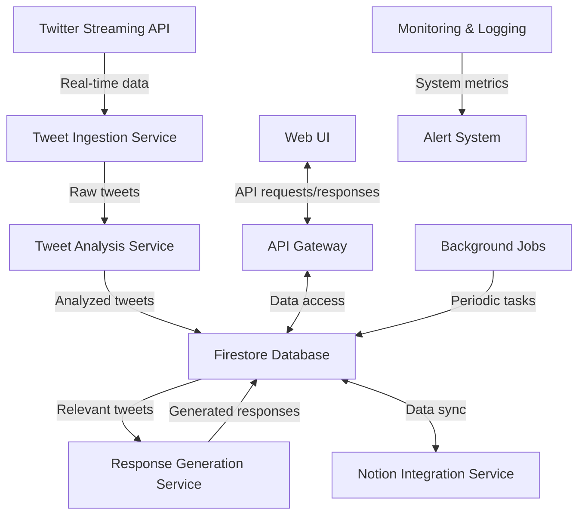

1. Tweet Ingestion Service:
   - Implemented in Python
   - Utilizes Google Cloud Functions
   - Connects to Twitter's Streaming API
   - Filters tweets based on relevance to AI coding tools

2. Tweet Analysis Service:
   - Python-based microservice running on Google Cloud Run
   - Performs sentiment analysis and calculates doubt rating
   - Utilizes Google Cloud Natural Language API

3. Response Generation Service:
   - Python-based microservice on Google Cloud Run
   - Integrates with a Large Language Model (e.g., GPT-4)
   - Generates contextually appropriate responses to tweets

4. Notion Integration Service:
   - Python-based microservice on Google Cloud Run
   - Synchronizes data between Firestore and Notion database
   - Implements Notion API for real-time updates

5. Web UI:
   - React-based single-page application with TypeScript
   - Styled using Tailwind CSS for responsive design
   - Hosted on Google Cloud Storage with Cloud CDN

6. API Gateway:
   - Google Cloud API Gateway
   - Manages authentication, rate limiting, and routing

7. Database:
   - Google Cloud Firestore for real-time data storage
   - Stores tweets, responses, user data, and system configuration

8. Background Jobs:
   - Implemented using Google Cloud Scheduler and Cloud Functions
   - Handles periodic tasks like data cleanup and report generation

9. Monitoring & Logging:
   - Google Cloud Monitoring for system metrics and alerts
   - Google Cloud Logging for centralized log management

### Key Features

1. Real-time Tweet Monitoring: Continuously tracks and identifies relevant tweets expressing skepticism about AI coding tools.

2. Sentiment Analysis: Analyzes tweet content to determine the level of skepticism or negativity towards AI coding tools.

3. Automated Response Generation: Utilizes LLM technology to create contextually appropriate responses to identified tweets.

4. Notion Database Integration: Seamlessly syncs tweet data and generated responses with a Notion database for easy access and collaboration.

5. User Interface: Provides a web-based dashboard for monitoring incoming tweets, reviewing collected data, and managing system parameters.

6. Analytics and Reporting: Generates insights and trends related to AI coding tool skepticism over time.

7. API Access: Offers a RESTful API for programmatic access to system functions and data.

### Technology Stack

- Frontend: React with TypeScript, Tailwind CSS
- Backend: Python 3.9+
- Cloud Platform: Google Cloud Platform (GCP)
- Database: Google Cloud Firestore
- API Management: Google Cloud API Gateway
- Containerization: Docker
- CI/CD: Google Cloud Build
- Monitoring: Google Cloud Monitoring and Logging

### Scalability and Performance

The Code Skeptic Scanner is designed to handle high volumes of incoming tweets and user requests:

- Horizontal scaling of microservices using Google Cloud Run
- Auto-scaling based on CPU utilization and request volume
- Caching layer using Google Cloud Memorystore for frequently accessed data
- Asynchronous processing of non-critical tasks using Google Cloud Pub/Sub

### Security Measures

- All communications encrypted using TLS 1.3
- OAuth 2.0 and JWT for authentication and authorization
- Regular security audits and penetration testing
- Compliance with GDPR and other relevant data protection regulations

### Integration Points

1. Twitter API: For real-time tweet ingestion and posting responses
2. Notion API: For database synchronization and collaboration features
3. Large Language Model API: For generating contextually appropriate responses
4. Google Cloud Services: For various infrastructure and platform services

This system overview provides a high-level description of the Code Skeptic Scanner, outlining its architecture, key components, features, and technologies. The design emphasizes scalability, real-time processing, and integration with modern cloud services to deliver a robust solution for monitoring and engaging with AI coding tool sentiment on social media.

## SYSTEM ARCHITECTURE

### PROGRAMMING LANGUAGES

The Code Skeptic Scanner will utilize the following programming languages:

| Language   | Purpose                                   | Justification                                                                                                   |
|------------|-------------------------------------------|------------------------------------------------------------------------------------------------------------------|
| TypeScript | Frontend development                      | Provides static typing for improved code quality and developer productivity in React applications               |
| Python     | Backend services and data processing      | Excellent for data processing, API integrations, and machine learning tasks with a rich ecosystem of libraries  |
| SQL        | Database queries (when needed)            | For complex queries in Cloud Firestore or potential future relational database integration                      |
| YAML       | Configuration files                       | Used for CI/CD pipelines, Kubernetes configurations, and other infrastructure-as-code needs                     |
| Bash       | Scripting for DevOps and automation       | Useful for writing deployment scripts and automating routine tasks in the development and operations processes |

### HIGH-LEVEL ARCHITECTURE DIAGRAM

The following diagram provides an overview of the Code Skeptic Scanner's high-level architecture:


This architecture leverages Google Cloud Platform services to ensure scalability, reliability, and ease of management. The system is composed of several microservices that communicate through APIs and message queues, allowing for independent scaling and deployment.

### COMPONENT DIAGRAMS

Here's a more detailed look at the main components of the Code Skeptic Scanner:

1. Tweet Ingestion Service:

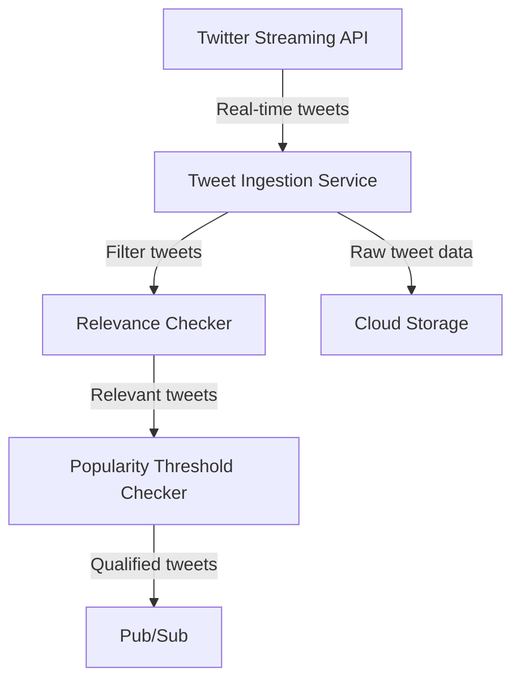

2. Tweet Analysis Service:

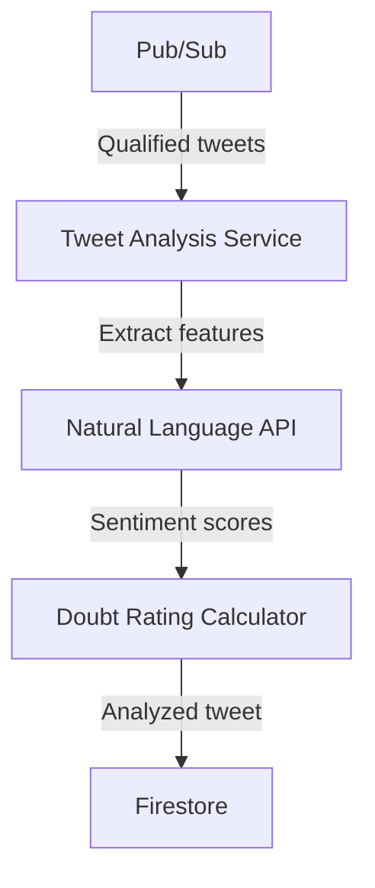

3. Response Generation Service:

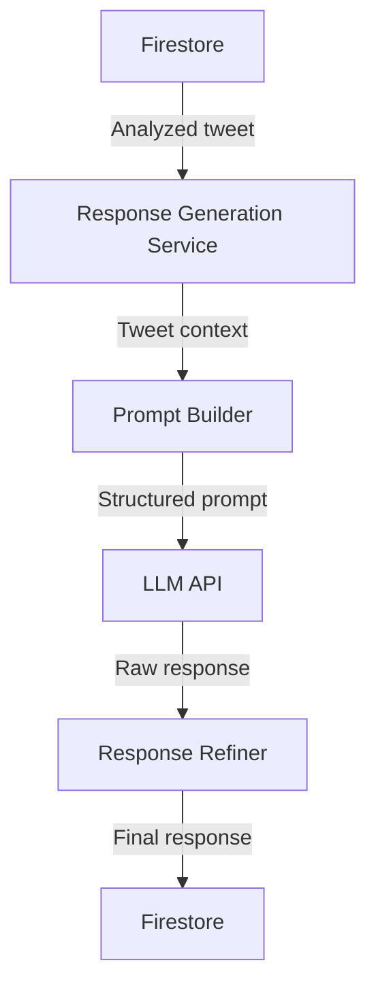

4. Web UI:

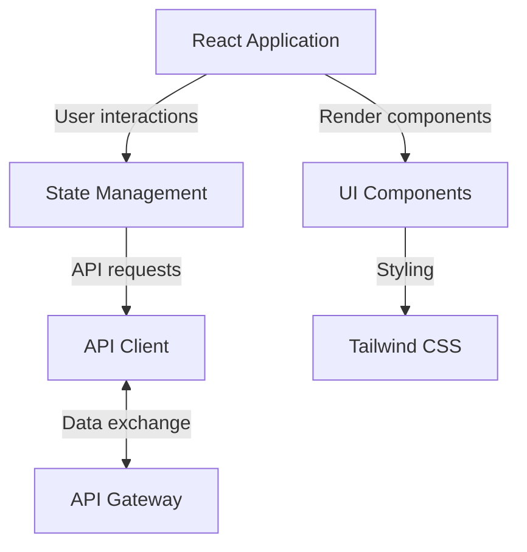

### SEQUENCE DIAGRAMS

1. Tweet Processing Sequence:

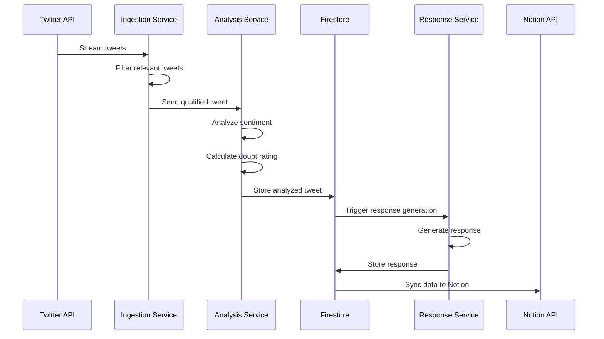

2. User Interaction Sequence:

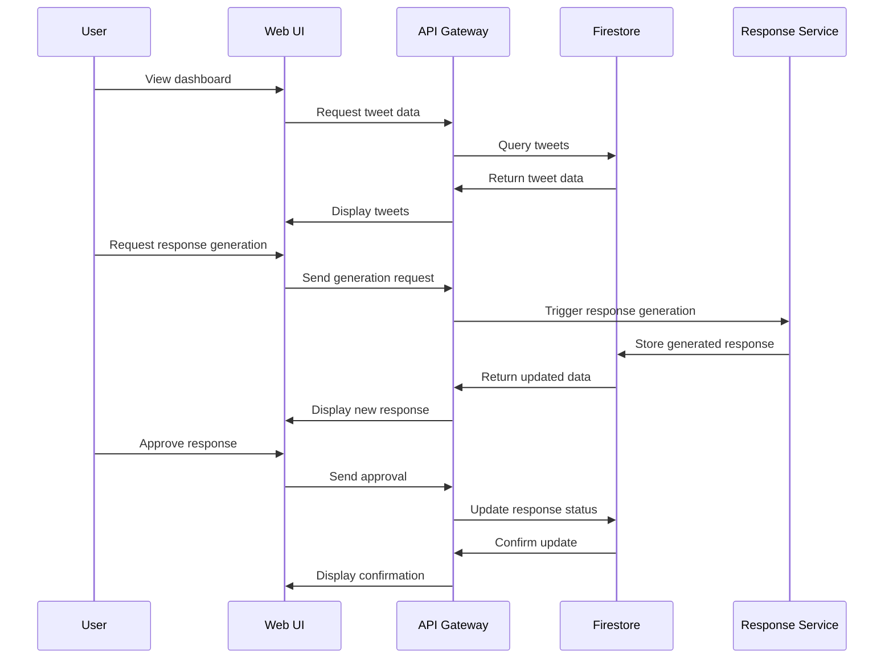

### DATA-FLOW DIAGRAM

The following diagram illustrates how information moves through the Code Skeptic Scanner system:

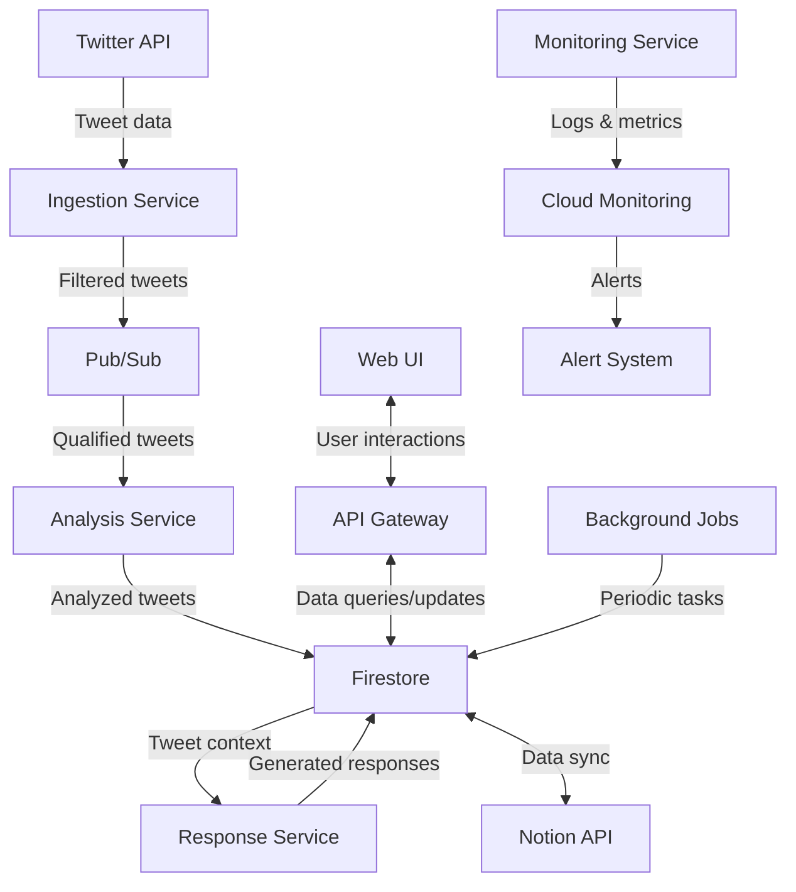

In this data flow:

1. Tweet data is ingested from the Twitter API and filtered for relevance.
2. Qualified tweets are sent to the Analysis Service via Pub/Sub for processing.
3. Analyzed tweets are stored in Firestore, which serves as the central data store.
4. The Response Service generates appropriate responses based on the analyzed tweets.
5. Data is synchronized with Notion for external collaboration and viewing.
6. The Web UI interacts with the system through the API Gateway, allowing users to view data and trigger actions.
7. Background jobs perform periodic tasks such as data cleanup or report generation.
8. The Monitoring Service collects logs and metrics, sending them to Cloud Monitoring for analysis and alerting.

This architecture ensures a smooth flow of data from ingestion to analysis, storage, and presentation, with appropriate interfaces for user interaction and system monitoring.

## SYSTEM DESIGN

### PROGRAMMING LANGUAGES

The Code Skeptic Scanner will utilize the following programming languages:

| Language   | Purpose                                   | Justification                                                                                                   |
|------------|-------------------------------------------|------------------------------------------------------------------------------------------------------------------|
| TypeScript | Frontend development                      | Provides static typing for improved code quality and developer productivity in React applications               |
| Python     | Backend services and data processing      | Excellent for data processing, API integrations, and machine learning tasks with a rich ecosystem of libraries  |
| SQL        | Database queries (when needed)            | For complex queries in Cloud Firestore or potential future relational database integration                      |
| YAML       | Configuration files                       | Used for CI/CD pipelines, Kubernetes configurations, and other infrastructure-as-code needs                     |
| Bash       | Scripting for DevOps and automation       | Useful for writing deployment scripts and automating routine tasks in the development and operations processes |

### DATABASE DESIGN

The Code Skeptic Scanner will use Google Cloud Firestore as its primary database. Firestore is a NoSQL document database that provides real-time synchronization and offline support, which aligns well with the system's requirements for real-time updates and scalability.

Here's an overview of the main collections and their structures:

1. Tweets Collection
```
tweets/
    {tweet_id}/
        account_handle: string
        followers_count: number
        likes_count: number
        timestamp: timestamp
        content: string
        media_urls: array<string>
        quoted_tweet_content: string
        doubt_rating: number
        ai_tools_mentioned: array<string>
        responses: array<reference> // References to responses collection
```

2. Responses Collection
```
responses/
    {response_id}/
        tweet_id: string // Reference to parent tweet
        content: string
        generated_at: timestamp
        status: string // e.g., "pending", "approved", "posted"
        generated_by: string // LLM model or user ID
```

3. Contexts Collection
```
contexts/
    {context_id}/
        name: string
        content: string
        created_at: timestamp
        updated_at: timestamp
```

4. Prompts Collection
```
prompts/
    {prompt_id}/
        name: string
        content: string
        created_at: timestamp
        updated_at: timestamp
```

5. Users Collection
```
users/
    {user_id}/
        username: string
        email: string
        role: string
        last_login: timestamp
```

### API DESIGN

The Code Skeptic Scanner will expose a RESTful API for communication between the frontend and backend, as well as for potential integration with external systems. The API will be implemented using Google Cloud Functions and secured with OAuth 2.0 authentication.

Here's an overview of the main API endpoints:

1. Tweets API
```
GET /api/tweets - List tweets (with pagination and filtering)
GET /api/tweets/{tweet_id} - Get a specific tweet
POST /api/tweets/{tweet_id}/responses - Generate a response for a tweet
```

2. Responses API
```
GET /api/responses - List responses (with pagination and filtering)
GET /api/responses/{response_id} - Get a specific response
PUT /api/responses/{response_id} - Update a response (e.g., approve, edit)
POST /api/responses/{response_id}/post - Post a response to Twitter
```

3. Contexts API
```
GET /api/contexts - List contexts
POST /api/contexts - Create a new context
PUT /api/contexts/{context_id} - Update a context
DELETE /api/contexts/{context_id} - Delete a context
```

4. Prompts API
```
GET /api/prompts - List prompts
POST /api/prompts - Create a new prompt
PUT /api/prompts/{prompt_id} - Update a prompt
DELETE /api/prompts/{prompt_id} - Delete a prompt
```

5. Users API
```
GET /api/users - List users (admin only)
POST /api/users - Create a new user (admin only)
PUT /api/users/{user_id} - Update a user
DELETE /api/users/{user_id} - Delete a user (admin only)
```

6. Analytics API
```
GET /api/analytics/trends - Get trend data
GET /api/analytics/performance - Get system performance metrics
```

### USER INTERFACE DESIGN

The Code Skeptic Scanner will feature a responsive web-based user interface built with React, TypeScript, and Tailwind CSS. The UI will be designed with a focus on usability, efficiency, and clarity.

Here's an overview of the main UI components:

1. Dashboard
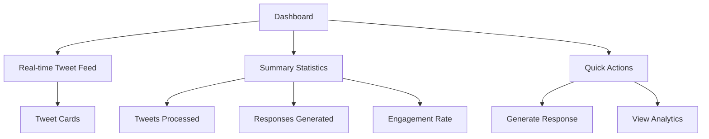

2. Tweet Management Interface
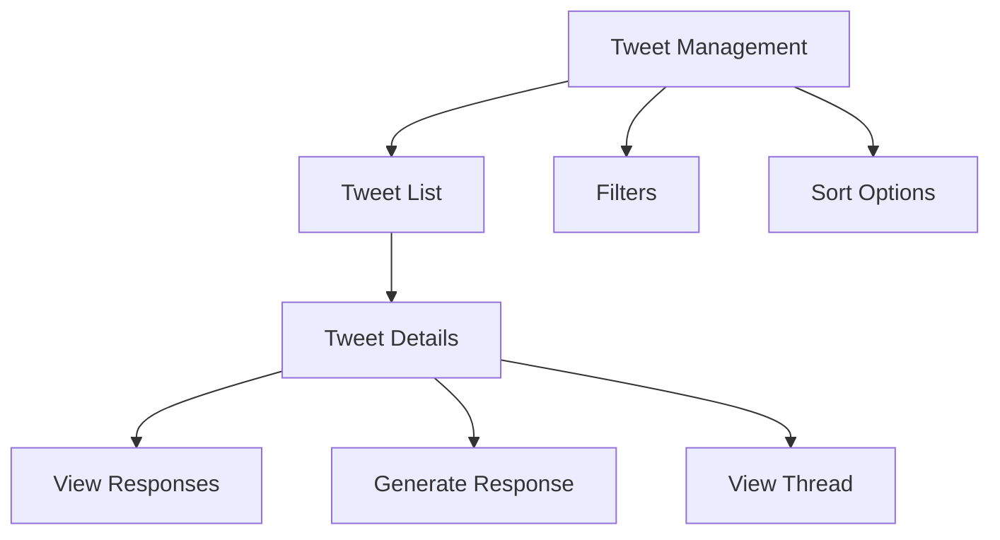

3. Response Management Interface
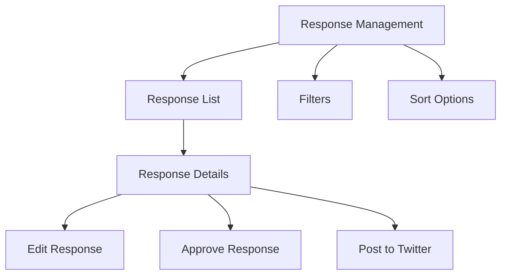

4. Settings and Configuration Panel
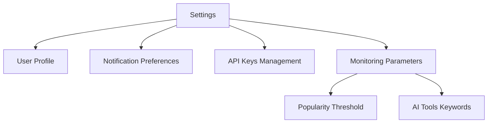

5. Analytics Dashboard
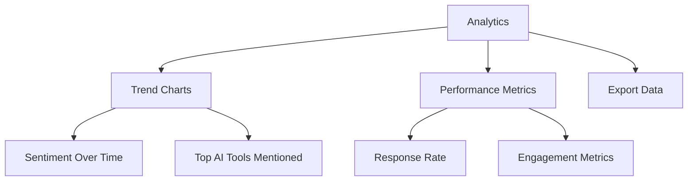

The UI will be implemented using a component-based architecture, with reusable components styled using Tailwind CSS for consistency and ease of maintenance. The layout will be responsive, adapting to different screen sizes and devices.

Key UI/UX considerations:
- Use of a color scheme that enhances readability and reduces eye strain
- Implementation of keyboard shortcuts for power users
- Inclusion of tooltips and help text for complex features
- Use of skeleton loaders and progressive loading for improved perceived performance
- Implementation of error handling and user feedback mechanisms
- Accessibility features to ensure WCAG 2.1 AA compliance

This system design provides a comprehensive overview of the programming languages, database structure, API endpoints, and user interface components for the Code Skeptic Scanner. The design leverages Google Cloud services, React, TypeScript, and Tailwind CSS as specified, ensuring consistency with previous technology choices and providing a scalable, maintainable solution.

## TECHNOLOGY STACK

### PROGRAMMING LANGUAGES

The Code Skeptic Scanner will utilize the following programming languages:

| Language   | Purpose                                   | Justification                                                                                                   |
|------------|-------------------------------------------|------------------------------------------------------------------------------------------------------------------|
| TypeScript | Frontend development                      | Provides static typing for improved code quality and developer productivity in React applications               |
| Python     | Backend services and data processing      | Excellent for data processing, API integrations, and machine learning tasks with a rich ecosystem of libraries  |
| SQL        | Database queries (when needed)            | For complex queries in Cloud Firestore or potential future relational database integration                      |
| YAML       | Configuration files                       | Used for CI/CD pipelines, Kubernetes configurations, and other infrastructure-as-code needs                     |
| Bash       | Scripting for DevOps and automation       | Useful for writing deployment scripts and automating routine tasks in the development and operations processes |

### FRAMEWORKS AND LIBRARIES

The following frameworks and libraries will be used in the development of the Code Skeptic Scanner:

Frontend:
- React: JavaScript library for building user interfaces
- Next.js: React framework for server-side rendering and static site generation
- Tailwind CSS: Utility-first CSS framework for rapid UI development
- React Query: Data fetching and state management library
- React Hook Form: Library for flexible and efficient form handling
- Chart.js: JavaScript charting library for data visualization

Backend:
- FastAPI: Modern, fast (high-performance) Python web framework for building APIs
- Pydantic: Data validation and settings management using Python type annotations
- SQLAlchemy: SQL toolkit and Object-Relational Mapping (ORM) library for Python
- Celery: Distributed task queue for handling background jobs
- NumPy and Pandas: Libraries for numerical computing and data manipulation
- Scikit-learn: Machine learning library for Python (for sentiment analysis)

DevOps and Infrastructure:
- Docker: Containerization platform for consistent development and deployment environments
- Terraform: Infrastructure-as-Code tool for managing cloud resources
- Prometheus: Monitoring and alerting toolkit
- Grafana: Analytics and interactive visualization web application

### DATABASES

The Code Skeptic Scanner will primarily use Google Cloud Firestore as its database solution. However, additional database systems may be employed for specific purposes:

| Database             | Purpose                                            | Justification                                                                        |
|----------------------|----------------------------------------------------|--------------------------------------------------------------------------------------|
| Google Cloud Firestore | Primary database for storing tweets and responses   | NoSQL database with real-time capabilities, ideal for the project's requirements     |
| Redis                | Caching and rate limiting                          | In-memory data structure store for high-performance caching and rate limit tracking |
| Google Cloud Storage | Long-term storage of raw tweet data and backups    | Scalable object storage for large volumes of unstructured data                       |

### THIRD-PARTY SERVICES

The Code Skeptic Scanner will integrate with the following third-party services and APIs:

1. Twitter API v2
   - Purpose: Real-time tweet monitoring and posting responses
   - Integration: Python library `tweepy` for API interaction

2. Notion API
   - Purpose: Synchronization of tweet data and responses with Notion database
   - Integration: Official Notion Python SDK

3. OpenAI GPT-4 API
   - Purpose: Generation of contextually appropriate responses to tweets
   - Integration: OpenAI Python library

4. Google Cloud Services
   - Cloud Run: For hosting containerized microservices
   - Cloud Functions: For serverless event-driven computations
   - Cloud Pub/Sub: For asynchronous messaging between services
   - Cloud Monitoring and Logging: For system observability and diagnostics

5. SendGrid Email API
   - Purpose: Sending email notifications to users and administrators
   - Integration: SendGrid Python library

6. Sentry
   - Purpose: Error tracking and performance monitoring
   - Integration: Sentry SDK for Python and JavaScript

7. Auth0
   - Purpose: User authentication and authorization
   - Integration: Auth0 SDK for React and Python

This technology stack leverages modern, scalable, and efficient tools and services that align with the project requirements. The use of TypeScript, React, and Tailwind CSS for the frontend, Python for the backend, and Google Cloud services for infrastructure ensures consistency with previous technology choices while providing a robust foundation for the Code Skeptic Scanner system.

## SECURITY CONSIDERATIONS

### AUTHENTICATION AND AUTHORIZATION

The Code Skeptic Scanner will implement a robust authentication and authorization system to ensure secure access to the application and its resources.

1. Authentication:
   - OAuth 2.0 will be used for user authentication, leveraging Google Cloud Identity Platform.
   - Multi-factor authentication (MFA) will be mandatory for all user accounts.
   - JSON Web Tokens (JWT) will be used for maintaining authenticated sessions.

2. Authorization:
   - Role-Based Access Control (RBAC) will be implemented to manage user permissions.
   - The following roles will be defined:

| Role | Description | Permissions |
|------|-------------|-------------|
| Admin | System administrators | Full access to all features and settings |
| Analyst | Data analysts and researchers | Read access to all data, ability to generate reports |
| Moderator | Content moderators | Ability to review and approve responses |
| Viewer | Basic users | Read-only access to dashboards and reports |

3. Implementation:
   - Frontend (React with TypeScript):
     - Use React Context API for managing authentication state.
     - Implement protected routes using React Router.
   - Backend (Python):
     - Use Google Cloud Identity Platform for user management.
     - Implement middleware for JWT validation and role-based access control.

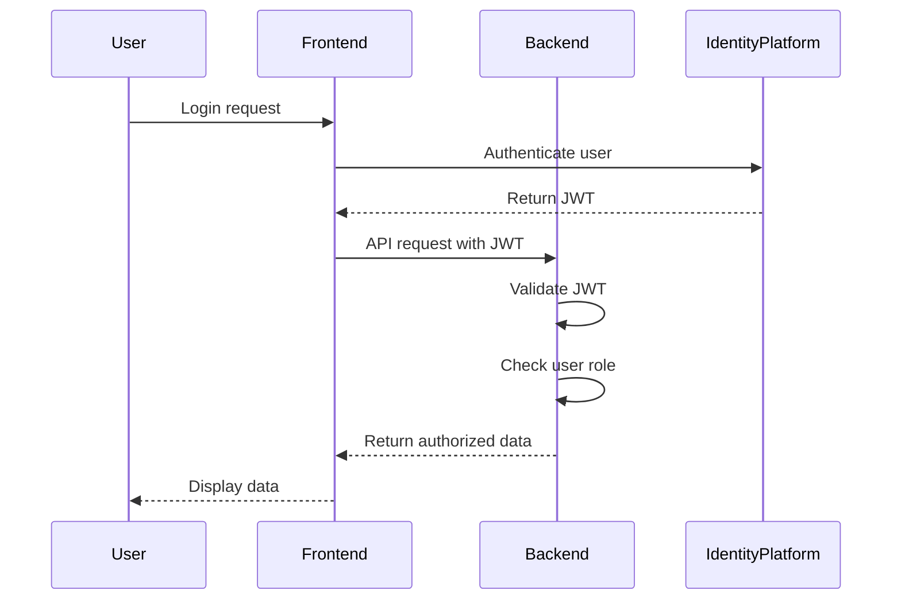

### DATA SECURITY

To protect sensitive information and ensure compliance with data protection regulations, the following measures will be implemented:

1. Encryption:
   - Data at rest: All data stored in Google Cloud Firestore will be encrypted using Google's default encryption.
   - Data in transit: All network communications will use TLS 1.3 or higher.

2. Data Classification:
   - Implement a data classification system to categorize information based on sensitivity.
   - Apply appropriate security controls based on data classification.

| Classification | Description | Examples | Security Controls |
|----------------|-------------|----------|-------------------|
| Public | Non-sensitive information | Published tweets | No additional controls |
| Internal | Business data not for public | Aggregated analytics | Access restricted to authenticated users |
| Confidential | Sensitive business data | User account details | Encrypted, access logged, limited to authorized roles |
| Restricted | Highly sensitive data | API keys, passwords | Encrypted, access logged, restricted to admin role |

3. Data Handling:
   - Implement data minimization practices, collecting and storing only necessary information.
   - Regularly review and purge unnecessary data.
   - Anonymize or pseudonymize personal data where possible.

4. Access Controls:
   - Implement least privilege access principles.
   - Use Google Cloud Identity and Access Management (IAM) for managing access to cloud resources.

5. Audit Logging:
   - Enable comprehensive audit logging for all data access and modifications.
   - Use Google Cloud Logging for centralized log management and analysis.

### SECURITY PROTOCOLS

The following security protocols will be implemented to maintain the overall security of the Code Skeptic Scanner system:

1. Network Security:
   - Deploy the application within a Virtual Private Cloud (VPC) on Google Cloud Platform.
   - Implement firewall rules to restrict inbound and outbound traffic.
   - Use Cloud NAT for outbound internet access from private instances.

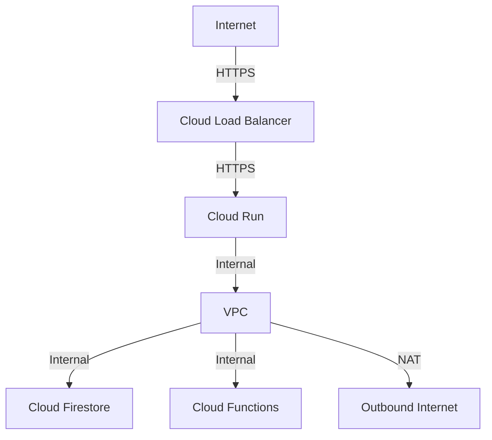

2. Application Security:
   - Implement input validation and sanitization for all user inputs.
   - Use parameterized queries to prevent SQL injection attacks.
   - Set secure HTTP headers (e.g., Content Security Policy, X-XSS-Protection).
   - Implement rate limiting to prevent abuse and DDoS attacks.

3. Dependency Management:
   - Regularly update all dependencies to their latest secure versions.
   - Use tools like Dependabot for automated dependency updates.
   - Conduct regular vulnerability scans of the application and its dependencies.

4. Secure Development Practices:
   - Follow OWASP Top 10 guidelines for web application security.
   - Implement code review processes with a focus on security.
   - Use static code analysis tools to identify potential security issues.

5. Incident Response:
   - Develop and maintain an incident response plan.
   - Conduct regular security drills to test the incident response process.
   - Use Google Cloud Security Command Center for threat detection and security analytics.

6. Compliance:
   - Ensure GDPR compliance for handling personal data.
   - Implement data subject access request (DSAR) handling procedures.
   - Conduct regular security audits and penetration testing.

7. API Security:
   - Use Google Cloud API Gateway for managing and securing API endpoints.
   - Implement API key rotation policies.
   - Use OAuth 2.0 for API authentication and JWT for authorization.

8. Monitoring and Alerting:
   - Set up real-time monitoring for security events using Google Cloud Monitoring.
   - Configure alerts for suspicious activities or potential security breaches.
   - Implement automated responses to common security events.

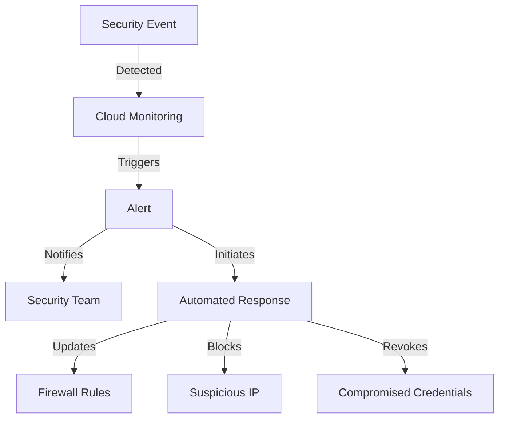

By implementing these security considerations, the Code Skeptic Scanner will maintain a strong security posture, protecting sensitive data and ensuring the integrity and availability of the system. Regular security assessments and updates to these protocols will be necessary to address evolving threats and maintain compliance with relevant regulations.